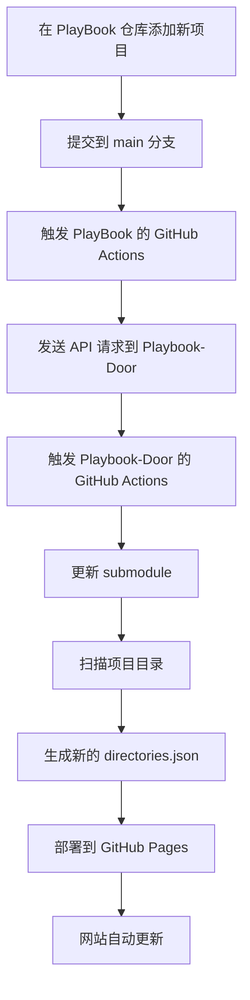

# PlayBook 仓库设置指南

## 📋 目标

当 PlayBook 仓库（子仓库）有新的提交时，自动触发 Playbook-Door 仓库（父仓库）的部署。

## 🔧 设置步骤

### 1. 在 PlayBook 仓库中创建 GitHub Actions

在 `PlayBook` 仓库中创建文件：`.github/workflows/notify-parent.yml`

```yaml
name: Notify Parent Repository

on:
  push:
    branches: [ main ]
  workflow_dispatch:

jobs:
  notify-parent:
    runs-on: ubuntu-latest
    steps:
    - name: Trigger parent repository deployment
      run: |
        curl -X POST \
          -H "Accept: application/vnd.github.v3+json" \
          -H "Authorization: token ${{ secrets.PARENT_REPO_TOKEN }}" \
          -H "X-GitHub-Api-Version: 2022-11-28" \
          https://api.github.com/repos/Space-tang/Playbook-Door/dispatches \
          -d '{"event_type":"submodule-update","client_payload":{"repository":"PlayBook","ref":"main","updated_at":"'$(date -u +%Y-%m-%dT%H:%M:%SZ)'"}}'
        
    - name: Show notification result
      run: |
        echo "✅ 已通知父仓库更新"
        echo "🔄 Playbook-Door 将自动部署最新内容"
```

### 2. 创建 Personal Access Token

1. **进入 GitHub Settings**
   ```
   https://github.com/settings/tokens
   ```

2. **创建新的 Token**
   - 点击 "Generate new token" → "Generate new token (classic)"
   - Note: `PlayBook to Playbook-Door`
   - Expiration: `No expiration` 或选择合适的时间
   - Scopes: 勾选以下权限：
     - `repo` (Full control of private repositories)
     - `workflow` (Update GitHub Action workflows)

3. **复制生成的 Token**
   - 保存好这个 token，只会显示一次

### 3. 在 PlayBook 仓库中添加 Secret

1. **进入 PlayBook 仓库设置**
   ```
   https://github.com/Space-tang/PlayBook/settings/secrets/actions
   ```

2. **添加新的 Secret**
   - 点击 "New repository secret"
   - Name: `PARENT_REPO_TOKEN`
   - Secret: 粘贴刚才创建的 Personal Access Token
   - 点击 "Add secret"

### 4. 测试设置

1. **在 PlayBook 仓库中做一个测试提交**
   ```bash
   # 在 PlayBook 仓库中
   echo "测试自动触发" > test-trigger.txt
   git add test-trigger.txt
   git commit -m "测试自动触发父仓库部署"
   git push origin main
   ```

2. **检查 Actions 运行状态**
   - PlayBook 仓库：`https://github.com/Space-tang/PlayBook/actions`
   - Playbook-Door 仓库：`https://github.com/Space-tang/Playbook-Door/actions`

## 🔄 工作流程



## 📝 使用示例

### 在 PlayBook 仓库中添加新项目

```bash
# 1. 创建新项目目录
mkdir my-awesome-api
cd my-awesome-api

# 2. 创建 __meta__.txt
cat > __meta__.txt << 'EOF'
title = 'Awesome API'
description = '一个功能强大的 RESTful API 项目'
class = "API"
tag = ["Node.js", "Express", "MongoDB"]
draft = false
EOF

# 3. 添加项目文件
echo "# Awesome API" > README.md
echo '{"name": "awesome-api"}' > package.json

# 4. 提交到仓库
cd ..
git add my-awesome-api/
git commit -m "添加新项目: Awesome API"
git push origin main
```

### 自动化结果

1. **PlayBook Actions 运行** → 通知父仓库
2. **Playbook-Door Actions 运行** → 更新 submodule，扫描项目
3. **网站自动更新** → 新项目出现在网站上

## 🐛 故障排除

### 问题 1: PlayBook Actions 失败

**检查**:
1. `PARENT_REPO_TOKEN` secret 是否正确设置
2. Token 是否有足够的权限
3. API 请求 URL 是否正确

### 问题 2: Playbook-Door 没有被触发

**检查**:
1. Playbook-Door 的 workflow 是否包含 `repository_dispatch` 触发器
2. `event_type` 是否匹配 (`submodule-update`)

### 问题 3: Submodule 没有更新

**检查**:
1. GitHub Actions 日志中的 submodule 更新步骤
2. 是否有权限问题

## 🎯 高级配置

### 只在特定目录变化时触发

如果你只想在特定目录变化时触发，可以修改 PlayBook 的 workflow：

```yaml
on:
  push:
    branches: [ main ]
    paths:
      - '*/\_\_meta\_\_.txt'  # 只有 __meta__.txt 文件变化时才触发
      - '*/'                  # 或者新增目录时触发
```

### 添加更多信息到通知

```yaml
- name: Trigger parent repository deployment
  run: |
    # 获取最新的 commit 信息
    COMMIT_MESSAGE=$(git log -1 --pretty=format:"%s")
    COMMIT_SHA=$(git rev-parse HEAD)
    
    curl -X POST \
      -H "Accept: application/vnd.github.v3+json" \
      -H "Authorization: token ${{ secrets.PARENT_REPO_TOKEN }}" \
      https://api.github.com/repos/Space-tang/Playbook-Door/dispatches \
      -d "{\"event_type\":\"submodule-update\",\"client_payload\":{\"repository\":\"PlayBook\",\"ref\":\"main\",\"commit_message\":\"$COMMIT_MESSAGE\",\"commit_sha\":\"$COMMIT_SHA\"}}"
```

---

**💡 提示**: 设置完成后，每次在 PlayBook 仓库中添加或修改项目时，Playbook-Door 网站会在几分钟内自动更新！