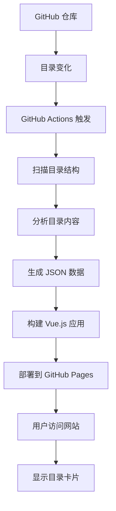

# Playbook Door 🚪

一个动态目录展示平台，自动同步 GitHub 仓库中的目录结构并以精美的卡片形式展示。


## 🌟 功能特性

- **🔄 自动同步**: 通过 GitHub Actions 自动检测仓库目录变化
- **🎨 精美界面**: 类似 Dify Marketplace 的现代化卡片设计
- **🤖 智能分类**: 根据目录内容自动分类（模板、API、数据库、DevOps等）
- **🔍 搜索过滤**: 支持关键词搜索和分类筛选
- **📱 响应式设计**: 完美适配桌面端和移动端
- **⚡ 实时更新**: 目录变化时自动更新展示内容
- **🚀 零配置部署**: 一键部署到 GitHub Pages

## 📋 目录

- [快速开始](#-快速开始)
- [详细部署指南](#-详细部署指南)
- [使用方法](#-使用方法)
- [工作原理](#-工作原理)
- [自定义配置](#-自定义配置)
- [故障排除](#-故障排除)
- [贡献指南](#-贡献指南)

## 🚀 快速开始

### 🌐 GitHub Pages 免费托管

**GitHub Pages** 是 GitHub 提供的免费静态网站托管服务，你的网站将托管在：
```
https://你的用户名.github.io/Playbook-Door/
```

### 1. Fork 仓库

点击右上角的 "Fork" 按钮，将仓库 Fork 到你的 GitHub 账户。

### 2. 启用 GitHub Pages（重要！）

1. 进入你 Fork 的仓库
2. 点击 **Settings** 标签
3. 在左侧菜单找到 **Pages**
4. 在 "Source" 下拉菜单选择 **GitHub Actions**
5. 保存设置

### 3. 等待自动部署

- 推送代码后，GitHub Actions 会自动构建和部署
- 在 **Actions** 标签页查看部署进度
- 通常需要 2-5 分钟完成

### 4. 访问你的网站

部署完成后访问：
```
https://你的用户名.github.io/Playbook-Door/
```

### 5. 本地开发（可选）

如果需要本地开发：

```bash
git clone https://github.com/你的用户名/Playbook-Door.git
cd Playbook-Door
npm install
npm run dev
```

访问 `http://localhost:3000` 查看效果。

## 📚 详细部署指南

### 步骤 1: 准备 GitHub 仓库

1. **Fork 或创建仓库**
   ```bash
   # 如果是新仓库
   git clone https://github.com/你的用户名/Playbook-Door.git
   cd Playbook-Door
   
   # 推送代码到你的仓库
   git add .
   git commit -m "初始化 Playbook Door 项目"
   git push origin main
   ```

2. **配置仓库权限**
   - 进入仓库设置: `Settings` → `Actions` → `General`
   - 在 "Workflow permissions" 部分选择 `Read and write permissions`
   - 勾选 `Allow GitHub Actions to create and approve pull requests`

### 🔧 如果遇到构建错误

如果 GitHub Actions 构建失败，常见解决方案：

1. **Node.js 版本问题**：
   - 工作流已配置使用 Node.js 20
   - 本地开发建议使用 Node.js 18+ 版本

2. **依赖安装问题**：
   - 工作流会自动清理并重新安装依赖
   - 本地可运行: `rm -rf node_modules package-lock.json && npm install`

3. **权限问题**：
   - 确保 Actions 有写入权限（参考上面的权限配置）

### 步骤 2: 启用 GitHub Pages

1. **进入 Pages 设置**
   - 仓库页面 → `Settings` → `Pages`

2. **配置部署源**
   - Source: 选择 `GitHub Actions`
   - 不需要选择分支，Actions 会自动处理

3. **等待首次部署**
   - 推送代码后，Actions 会自动运行
   - 在 `Actions` 标签页可以查看部署进度
   - 部署完成后，你的网站将在 `https://你的用户名.github.io/Playbook-Door/` 可用

### 步骤 3: 验证部署

1. **检查 Actions 状态**
   ```
   仓库页面 → Actions → 查看最新的 workflow 运行状态
   ```

2. **访问网站**
   ```
   https://你的用户名.github.io/Playbook-Door/
   ```

3. **验证功能**
   - 页面应该显示示例目录卡片
   - 搜索和筛选功能正常
   - 响应式布局在不同设备上正常显示

## 🎯 使用方法

### 添加新项目目录

#### 方法 1: 通过 GitHub 网页界面

1. **创建新目录**
   - 在仓库主页点击 `Create new file`
   - 输入路径: `my-awesome-project/README.md`
   - GitHub 会自动创建目录

2. **添加项目描述**
   ```markdown
   # My Awesome Project
   
   这是一个很棒的项目，用于演示某些功能。
   
   ## 功能特性
   - 功能1
   - 功能2
   - 功能3
   ```

3. **提交更改**
   - 填写提交信息: `添加新项目: my-awesome-project`
   - 点击 `Commit new file`

#### 方法 2: 通过命令行

1. **创建项目目录**
   ```bash
   mkdir my-awesome-project
   cd my-awesome-project
   ```

2. **添加项目文件**
   ```bash
   # 创建 README.md
   cat > README.md << 'EOF'
   # My Awesome Project
   
   这是一个很棒的项目，用于演示某些功能。
   
   ## 技术栈
   - Vue.js
   - Node.js
   - MongoDB
   EOF
   
   # 如果是前端项目，创建 package.json
   cat > package.json << 'EOF'
   {
     "name": "my-awesome-project",
     "version": "1.0.0",
     "description": "这是一个很棒的项目，用于演示某些功能",
     "keywords": ["vue", "frontend", "demo"],
     "main": "index.js"
   }
   EOF
   ```

3. **提交并推送**
   ```bash
   cd ..
   git add my-awesome-project/
   git commit -m "添加新项目: my-awesome-project"
   git push origin main
   ```

### 自动检测和更新流程

#### 1. 触发条件

GitHub Actions 会在以下情况自动运行：

- ✅ **推送到 main 分支** (最常用)
- ✅ **创建 Pull Request**
- ✅ **手动触发** (在 Actions 页面)
- ✅ **定时任务** (每天凌晨自动检查)

#### 2. 检测过程

当你添加/删除/修改目录后：

```bash
# 1. 推送代码触发 Actions
git push origin main

# 2. Actions 自动执行以下步骤：
#    - 检出代码
#    - 扫描所有目录
#    - 分析每个目录的内容
#    - 生成 directories.json 文件
#    - 构建 Vue.js 应用
#    - 部署到 GitHub Pages
```

#### 3. 查看执行状态

1. **进入 Actions 页面**
   ```
   仓库页面 → Actions 标签
   ```

2. **查看运行日志**
   - 点击最新的 workflow 运行
   - 展开 "Generate directories data" 步骤
   - 查看检测到的目录列表

3. **验证结果**
   - 等待部署完成（通常 2-5 分钟）
   - 刷新你的网站页面
   - 新目录应该自动显示为卡片

### 🌐 查找你的网站地址

你的 GitHub Pages 网站地址可以在以下位置找到：

1. **仓库设置页面**：
   ```
   仓库 → Settings → Pages → 顶部显示的地址
   ```

2. **地址规律**：
   ```
   https://你的用户名.github.io/Playbook-Door/
   ```

3. **示例**：
   - 用户名：`john-doe` 
   - 地址：`https://john-doe.github.io/Playbook-Door/`

### 目录分类规则

系统会根据目录名和内容自动分类：

| 目录名包含 | 分类 | 图标 | 颜色 | 示例 |
|-----------|------|------|------|------|
| `template`, `starter` | 模板 | 📄 | 蓝色 | `vue-template`, `react-starter` |
| `api`, `backend`, `server` | API | ⚙️ | 绿色 | `user-api`, `backend-service` |
| `database`, `db`, `sql` | 数据库 | 📊 | 橙色 | `mysql-schemas`, `db-migrations` |
| `deploy`, `docker`, `k8s` | DevOps | 📁 | 红色 | `docker-configs`, `k8s-deploy` |
| `frontend`, `web`, `ui` | 前端 | 📄 | 蓝色 | `admin-frontend`, `web-ui` |
| 其他 | 其他 | 📁 | 灰色 | `utils`, `docs` |

### 自定义项目信息

#### 通过 __meta__.txt 文件（推荐）

在每个项目目录下创建 `__meta__.txt` 文件来定义项目的元数据：

```bash
my-project/
├── __meta__.txt    # 项目元数据文件
├── src/
└── README.md
```

`__meta__.txt` 文件格式（TOML 格式）：
```toml
title = 'My First Post' # 必填 - 项目标题（显示在卡片上的大字）
description = 'Docker 容器化配置、Kubernetes 部署文件、CI/CD 流水线脚本，实现应用的自动化部署和运维' # 必填 - 项目描述
class = "分类1" # 可选 - 项目分类，如果未定义默认为"未定义"
tag = ["Docker","容器化"] # 可选 - 项目标签，显示为蓝色标签
draft = false # 可选 - 是否为草稿，true=不显示，false=显示
```

#### 字段说明

- **title**: 卡片标题，会显示为卡片上的大字
- **description**: 项目描述，显示在标题下方
- **class**: 项目分类，用于筛选和图标显示（**重要：这个字段决定了动态分类**）
- **tag**: 项目标签数组，显示为蓝色标签
- **draft**: 草稿状态，`true` 时该目录不会在网站上显示

#### 🎯 动态分类系统

系统会根据 `__meta__.txt` 文件中的 `class` 字段自动生成分类标签页：

**分类规则：**
- 如果 `class` 字段存在且不为空，使用该值作为分类
- 如果 `class` 字段不存在或为空，自动归类为"未定义"
- 相同 `class` 值的项目会自动合并到同一个分类标签页
- 分类标签页按字母顺序排序，"未定义"始终排在最后

**示例：**
```toml
# 项目A的 __meta__.txt
class = "API"

# 项目B的 __meta__.txt  
class = "API"

# 项目C的 __meta__.txt
class = "数据库"

# 项目D的 __meta__.txt（没有class字段）
title = "项目D"
```

**生成的分类标签页：**
- 全部 (4个项目)
- API (2个项目) 
- 数据库 (1个项目)
- 未定义 (1个项目)

#### 📝 完整示例

创建一个完整的项目目录：

```bash
# 1. 创建项目目录
mkdir my-awesome-api
cd my-awesome-api

# 2. 创建 __meta__.txt 文件
cat > __meta__.txt << 'EOF'
title = 'Awesome API 项目'
description = '一个功能强大的 RESTful API，提供用户管理、数据分析和实时通知功能'
class = "API"
tag = ["Node.js", "Express", "MongoDB", "REST"]
draft = false
EOF

# 3. 创建项目文件
echo "# Awesome API 项目" > README.md
echo '{"name": "awesome-api", "version": "1.0.0"}' > package.json

# 4. 提交到仓库
cd ..
git add my-awesome-api/
git commit -m "添加 Awesome API 项目"
git push origin main
```

**结果：**
- 网站会自动检测到新项目
- 在"API"分类标签页下显示该项目
- 如果"API"分类不存在，会自动创建该分类标签页

## 🔧 工作原理

### 系统架构



### 详细流程

1. **目录检测阶段**
   ```javascript
   // Actions 脚本会执行类似这样的逻辑
   const directories = fs.readdirSync('.')
     .filter(item => fs.statSync(item).isDirectory())
     .filter(item => !item.startsWith('.'))
     .filter(item => item !== 'node_modules')
   ```

2. **内容分析阶段**
   ```javascript
   // 对每个目录进行分析
   for (const dir of directories) {
     // 读取 README.md 获取描述
     // 读取 package.json 获取标签
     // 根据目录名推断分类
     // 统计文件数量
   }
   ```

3. **数据生成阶段**
   ```json
   {
     "lastUpdate": "2024-01-20T10:30:00Z",
     "totalCount": 4,
     "directories": [...]
   }
   ```

4. **前端展示阶段**
   ```javascript
   // Vue.js 应用读取数据并渲染
   const response = await fetch('/directories.json')
   const data = await response.json()
   this.directories = data.directories
   ```

## ⚙️ 自定义配置

### 修改仓库信息

编辑 `src/api/modules/github.js`:

```javascript
// 修改默认的仓库信息
async getRepositoryDirectories(owner = '你的用户名', repo = '你的仓库名') {
  // ...
}
```

### 修改网站标题和描述

编辑 `src/view/Home.vue`:

```vue
<template>
  <div class="logo">
    <h1>你的网站标题</h1>
    <p>你的网站描述</p>
  </div>
</template>
```

### 修改分类规则

编辑 `.github/workflows/update-directories.yml` 中的分类逻辑:

```javascript
// 添加自定义分类规则
if (dirNameLower.includes('你的关键词')) {
  category = '你的分类'
  tags.push('你的标签')
}
```

### 修改样式主题

编辑 `src/view/Home.vue` 的样式部分:

```css
/* 修改主题色 */
.welcome-section {
  background: linear-gradient(135deg, #你的颜色1 0%, #你的颜色2 100%);
}
```

## 🔍 故障排除

### 常见问题

#### 1. Actions 执行失败

**问题**: GitHub Actions 显示红色 ❌

**解决方案**:
```bash
# 检查 Actions 权限
仓库设置 → Actions → General → Workflow permissions → Read and write permissions

# 检查分支保护规则
仓库设置 → Branches → 确保没有阻止 Actions 的规则
```

#### 2. 网站无法访问

**问题**: GitHub Pages 链接返回 404

**解决方案**:
```bash
# 检查 Pages 设置
仓库设置 → Pages → Source: GitHub Actions

# 检查部署状态
Actions 标签 → 查看最新的部署是否成功

# 等待 DNS 传播（新域名可能需要几分钟）
```

#### 3. 新目录没有显示

**问题**: 添加目录后网站没有更新

**解决方案**:
```bash
# 1. 检查 Actions 是否触发
Actions 标签 → 查看是否有新的运行记录

# 2. 手动触发 Actions
Actions 标签 → Update Directories → Run workflow

# 3. 检查目录是否符合条件
# 确保目录不是以 . 开头
# 确保目录不是 node_modules
# 确保目录包含文件（不是空目录）
```

#### 4. 卡片信息不正确

**问题**: 目录卡片显示的信息有误

**解决方案**:
```bash
# 检查 README.md 格式
# 第一段文字会被用作描述
# 确保 README.md 编码为 UTF-8

# 检查 package.json 格式
# 确保 JSON 格式正确
# description 和 keywords 字段会被使用
```

### 调试方法

#### 1. 查看 Actions 日志

```bash
# 进入 Actions 页面
仓库 → Actions → 点击最新运行 → 展开步骤查看详细日志
```

#### 2. 检查生成的数据

```bash
# 访问生成的 JSON 文件
https://你的用户名.github.io/Playbook-Door/directories.json
```

#### 3. 本地调试

```bash
# 本地运行 Actions 脚本
node .github/workflows/generate-directories.js

# 检查生成的文件
cat public/directories.json
```

## 🎨 高级用法

### 添加自定义字段

1. **修改 Actions 脚本**，在 `.github/workflows/update-directories.yml` 中添加:

```javascript
// 添加自定义字段
return {
  name: dirName,
  description,
  // ... 其他字段
  customField: '自定义值',
  priority: calculatePriority(dirName),
  lastCommit: getLastCommitInfo(dirPath)
}
```

2. **修改前端显示**，在 `src/view/Home.vue` 中使用:

```vue
<template>
  <div class="custom-info">
    {{ directory.customField }}
  </div>
</template>
```

### 集成外部 API

```javascript
// 在 src/api/modules/github.js 中添加
async getExternalData(projectName) {
  const response = await fetch(`https://api.example.com/projects/${projectName}`)
  return response.json()
}
```

### 添加统计分析

```javascript
// 在 Actions 脚本中添加统计
const stats = {
  totalProjects: directories.length,
  byCategory: directories.reduce((acc, dir) => {
    acc[dir.category] = (acc[dir.category] || 0) + 1
    return acc
  }, {}),
  totalFiles: directories.reduce((sum, dir) => sum + dir.fileCount, 0)
}
```

## 🤝 贡献指南

### 开发环境设置

```bash
# 1. Fork 并克隆仓库
git clone https://github.com/你的用户名/Playbook-Door.git
cd Playbook-Door

# 2. 安装依赖
npm install

# 3. 启动开发服务器
npm run dev

# 4. 创建功能分支
git checkout -b feature/amazing-feature

# 5. 提交更改
git commit -m "Add amazing feature"

# 6. 推送分支
git push origin feature/amazing-feature

# 7. 创建 Pull Request
```

### 代码规范

- 使用 Vue 3 Composition API
- 遵循 ESLint 规则
- 添加适当的注释
- 确保响应式设计
- 测试新功能

### 提交信息规范

```bash
# 功能添加
git commit -m "feat: 添加新的卡片样式"

# 问题修复
git commit -m "fix: 修复移动端显示问题"

# 文档更新
git commit -m "docs: 更新使用说明"

# 样式调整
git commit -m "style: 优化卡片间距"
```

## 📄 许可证

本项目采用 MIT 许可证 - 查看 [LICENSE](LICENSE) 文件了解详情。

## 🙏 致谢

- [Vue.js](https://vuejs.org/) - 渐进式 JavaScript 框架
- [Element Plus](https://element-plus.org/) - Vue 3 组件库  
- [GitHub Actions](https://github.com/features/actions) - CI/CD 平台
- [Dify](https://dify.ai/) - UI 设计灵感来源

## 📞 支持

如果你遇到问题或有建议，请：

1. 查看 [Issues](https://github.com/Space-tang/Playbook-Door/issues) 中是否有类似问题
2. 创建新的 Issue 描述你的问题
3. 提供详细的错误信息和复现步骤

---

**⭐ 如果这个项目对你有帮助，请给个 Star 支持一下！**